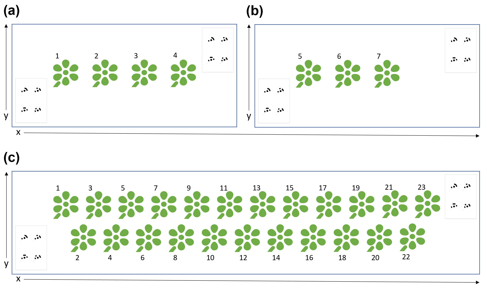
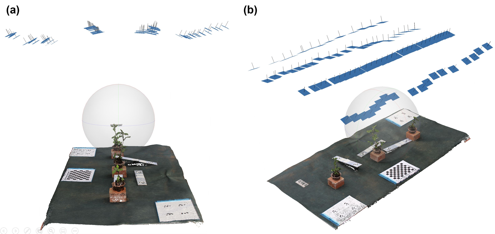

# Image acquisition

Materials : 

- Floor area minimum 1 m x 1 m, as level as possible.
- There is no maximum area
- Container plants. Avoid using green-colored container.
- Depending on user needs and python proficiency, it may be possible to measure objects other than container plants but that is not covered in the documentation.
- floor covering (black or other non-plant color) (optional)
- RGB camera
- Target pages: Print first 2 pages of `materials/targets.pdf`. Do not use two copies of page 1! ~~[EasyDCP requires 4 targets per page. i used 6mm radius .]~~ Attach to clipboard or other rigid backing. Measure the distances between the center points of the coded targets and compare to `materials/scalebars.csv`. Correct the .csv file if needed.

Prerequisites/considerations?: 

- **todo stable lighting and wind**
- **todo image acquisition area maximum size?**

## (a) Setup image acquisition area

1. The height of plant container is needed by EasyDCP, so be sure to measure and record the height of the container in meters. If the container is on any riser platform, record the height of the riser and add it to the container height. EasyDCP expects all plants to have the same container height.
2. If using floor covering, place on the desired area to be used for image acquisition. If not using floor covering, ensure floor area is free of any materials that may be similar to plant color (e.g. weeds)
3. Define measurement area by placing the two printed target pages at opposite corners. [see figure 1] Page 1 in bottom-left corner, page 2 in top-right corner. Ensure target pages are level (especially page 1!) and not upside-down. 
   - Note: The two outermost targets (1 and 8) define the boundaries of the point cloud region. This is enabled by default but can be disabled, and helps to reduce processing time. If plant canopies extend beyond the boundary box defined by the two outermost targets, ensure `crop_by_targets = False ` in `params.ini` during EasyDCP_Creation.

## (b) Image acquisition

1. Arrange a group of container plants within the measurement area, by placing them in a single row, or 2 rows using triangular spacing [see figure 1]. Ensure at least 10cm gap between all plants. *Note: The number of plants per group is only limited by the size of the measurement area and the size of the plants.*

   <p align="center"></p>

   *Figure 1*

2. Photograph the plants from above, in one or more rows parallel to plant row. We recommend 10-15 images per each meter of plant row at 1 meter camera distance from target. See figure 2 for example: 4 rows of images (blue rectangles) were captured over a 1 m x 2 m space, average 12 images per meter per row.

   <p align="center"></p>

   *Figure 2*

3. Repeat steps 4 and 5 for all remaining plants. We recommend to keep the number of plants per group constant if possible, and keep plant spacing uniform across groups. See figure 1a and 1b.

4. Organize photos into folders by group. The root folder can be located anywhere on any drive. One folder per one group of plants. Even if there is only one group, follow this folder structure. Create a `/skip/` folder and copy `/materials/scalebars.csv` and `/materials/orientation.ini` to `/skip/`.
   Example: for a given population, assume 9 plants divided into 3 groups of 3 plants each:

```
population001
├───group001
│   ├── IMG_0001.JPG
│   ├── IMG_0002.JPG
│   └── ...
├───group002
│   ├── IMG_0001.JPG
│   ├── IMG_0002.JPG
│   └── ...
├───group003
│   ├── IMG_0001.JPG
│   ├── IMG_0002.JPG
│   └── ...
└───skip
    ├── scalebars.csv
    ├── orientation.ini
    └── [other files/folders to ignore]
```

8. Proceed to [EasyDCP_Creation](1_EasyDCP_Creation.md).