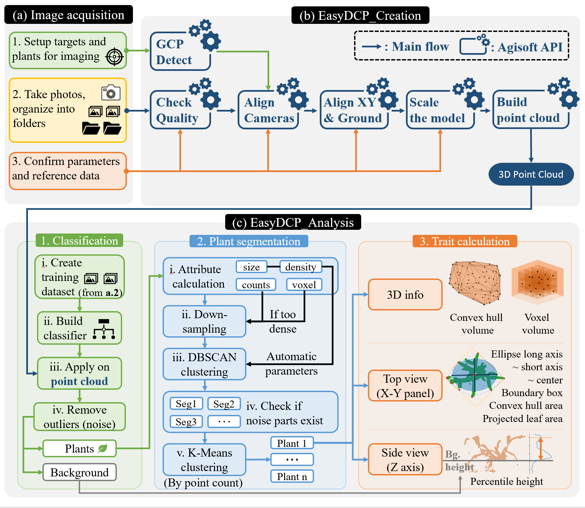

**See heading.md for installation instructions.**

Overview of EasyDCP workflow:

# 

## Image acquisition

Materials : 

Floor area minimum 1 m x 2 m

Container plants. Avoid using green-colored container.

floor covering (black or other non-plant color) (optional)

RGB camera

Printed attached .pdf file `easydcp\materials\targets.pdf`, first 2 pages. [easydcp requires 4 targets per page. i used 6mm radius .] Attach to clipboard or other rigid backing.

1. The height of plant container is needed by EasyDCP, so be sure to measure and record the height of the container.
2. If using floor covering, place on desired area to be used for image acquisition. If not using floor covering, ensure floor area is free of any materials that may be similar to plant color (e.g. weeds)
3. Define measurement area by placing the two printed target sheets at opposite corners. [see figure]
4. Arrange a group of container plants within the measurement area, by placing them in a single row, or 2 rows using triangular spacing [see image]. Ensure adequate gap between all plants. *Note: The number of plants per group is only limited by the size of the measurement area and the size of the plants.*
5. Photograph in one or more rows parallel to plant row. Recommend 5cm spacing . e.g., 20 images per each meter of plant row.
6. Repeat steps 3 and 4 for all remaining plants.
7. Organize photos into folders by group. One folder per one group of plants. (See example/images)
