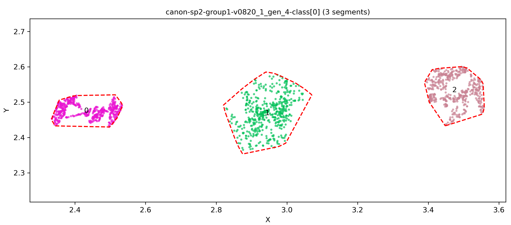
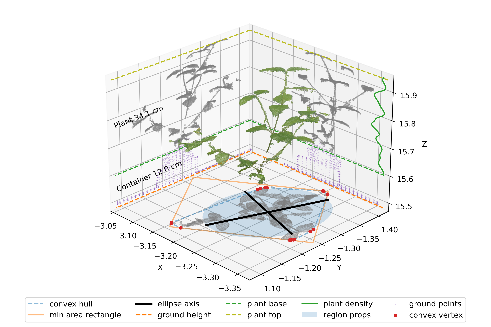

# EasyDCP_Analysis

### Materials: 

Point cloud files (.ply) from EasyDCP_Creation step

GIMP, Photoshop or equivalent software

Known height of container (mm) or ground offset height.

## (a) Setup - Creating training data

### Materials: 

- GIMP or equivalent software.
- Source image files from image acquisition

**Use GIMP to create training data:**

See example fore.png and back.png in `/example/training_data/`.

1. Use Free Select Tool to select plant parts only - Use a representative sample. Maybe 3 different plants is enough to represent them all e.g. one light green, one dark green, different light conditions, etc.
	* Deselect "Antialiasing" in Free Select settings pane
	* Select "'1. Pixel (3 x 3)" in Brushes tab
2. Copy the selection and create a new file, PNG *with transparency*
	* Under Advanced Options in "Create a New Image" dialog, select Fill with: Transparency
3. Save as "fore.png"
4. Repeat steps 1-3 with background samples and save as "back.png"

## (b) Running EasyDCP_Analysis

### Materials:

- Folder containing .ply point cloud files output by previous step, EasyDCP_Creation
  - See example `ply` folder in step 5 of EasyDCP_Creation
- training data created in previous step: "(a) Setup"
- Python script to control EasyDCP_Analysis package, `example/analysis.py` 

Control EasyDCP_Analysis via API using python script in your python 3.7 environment as described in [Installation](Installation.md). 

We have provided `analysis.py` in `/example/` as a starter script to control EasyDCP_Analysis. **Most users should be able to run `analysis.py` with very little modification.** To do: Complete [API documentation](api.md) for details on controlling EasyDCP_Analysis via python.

### Key functions:

| name                            | description                                                  |
| ------------------------------- | ------------------------------------------------------------ |
| `easydcp.Classifier()`          | Create a `Classifier` object using training data             |
| `easydcp.Plot()`                | Create a `Plot` object using input .ply file and `Classifier` object. |
| `easydcp.Plot.remove_noise()`   | Filter out noise points on `Plot` object.                    |
| `easydcp.Plot.dbscan_segment()` | Run segmentation using `DBSCAN` algorithm.                   |
| `easydcp.Plot.kmeans_split()`   | Separate plant point clouds and noise point clouds by point number. |
| `easydcp.Plot.rank_split()`     | Alternative to `kmeans_split`. Discard noise point clouds by passing known numer of plants as a parameter. |
| `easydcp.Plot.sort_order()`     | Sort Plant ID in order of increasing x-axis of plant center. Needed when using `dbscan_segment` or `kmeans_split`. |
| `easydcp.Plot.xaxis_segment()`  | Alternative to `dbscan_segment`. Segment the `Plot` object into plants by passing the number of segments (plants) as a parameter. This function assumes plants are of approximately equal size and evenly spaced. |
| `easydcp.Plot.get_traits()`     | Calculate traits for all segments (plants) within the `Plot` object. |

**Key Parameters:**

| name         | default | affects      | notes                                                        |      |
| ------------ | ------- | ------------ | ------------------------------------------------------------ | ---- |
| `percentile` | 98      | plant height | adjust parameter in line 718 of `base.py`, `__init__()` :`self.get_percentile_height(container_ht, ground_ht, percentile=95)`<br /> `98` should give a near-maximum plant height in most cases.  For a measurement closer to the true maximum plant height (highest plant point), increase to `99`, `99.5`, etc. A lower-quality point cloud (e.g., produced from an image set with low overlap or resolution, or low settings used by EasyDCP_Creation) may contain some noise points above the true plant top and could cause overestimation bias. In this case, consider decreasing to `95` or `90`. |      |
| `eps_points` | 10      | segmentation | Set parameter when calling `dbscan_segment` <br />Higher value may be used if segmentation fails, such as one plant being wrongly divided into two segments. In such case, we recommend trying `12`,`13`,`14`. Higher `eps_points` value will increase processing time significantly. |      |


1. **Configure EasyDCP_Analysis before launching:**

	- Ensure your .py script points to correct training data and point clouds. *Ensure `container_ht` is correctly set.* 
	  - Training data is called as `list` in `Classifier()` function, `path_list` parameter. Vegetation file must be listed before background file.
	  - Point clouds are loaded by `plot_set` variable
	  - `container_ht` parameter is passed within `get_traits()` function. Default: `0.06` (meters, 6 cm container)
	- Ensure to `import __init__` before `import easydcp`. This is already done in `analysis.py`.
  ```python
  import __init__
  import easydcp as dcp
  ```

2. **Execute your .py script using python, with EasyDCP root folder as working directory:**
	
- Using Anaconda, open a terminal and navigate to your EasyDCP folder: `cd D:\Program\EasyDCP``
   
  `(easydcp37) D:\Program\EasyDCP>python example\analysis.py`
	
3. **Outputs will be saved in the EasyDCP directory.** 
   
   - A folder will be created in the EasyDCP directory for each .ply file processed by EasyDCP. It  will contain several intermediary .ply files (output by the *classification*, *remove noise* and *segmentation* steps) and a .png file is for each `Plant` object measured by the *calculation* step. The .png file contains an image of the plant point cloud, and visualization of phenotypic traits.
   - A folder called `data_out` will be created in the EasyDCP directory. It will contain:
     - Segmentation results. Each input .ply file will have a corresponding .png image file, showing an overhead view of the plant points and their segmentation results. (See Figure 1)
     - `traits.csv`, containing per-plant traits and metadata. This file can be read by a variety of softwares including Excel and R and used for data analysis. (See Figure 2)
   - The output locations may be adjusted using parameters of their respective functions, except the intermediary .ply files which can only be disabled via the `write_ply` parameter.

**We strongly recommend to move your output data out of the EasyDCP directory. Data loss may occur when re-running the script, as folders will be re-created in the working directory, and may overwrite previous output folders.**

<p align="center"></p>

*Figure 1: Segmentation results*

<p align="center"></p>

*Figure 2: Traits*