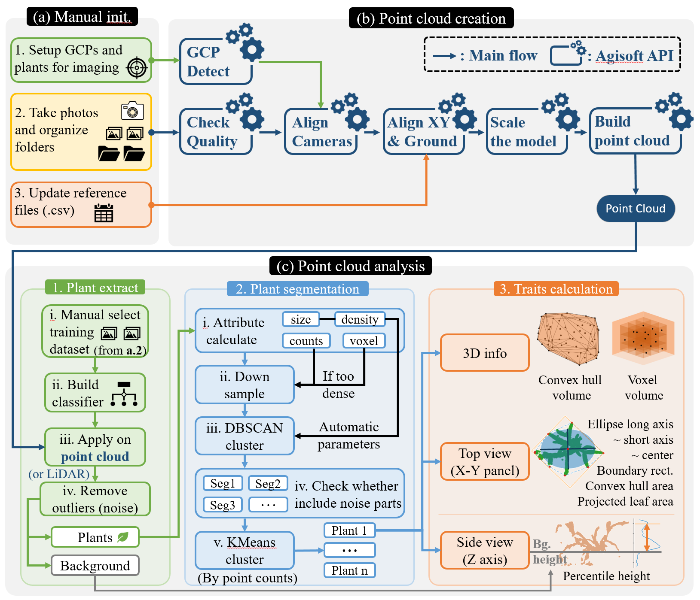

**See root folder README.md for installation**

Image below: Draft version. Update later.

# 

# Point cloud creation

## Image acquisition/capturing (manual init.)

Materials : 

Container plants 

floor covering (black or other non-plant color)

RGB camera

Print attached .pdf file `easypcp\materials\targets.pdf`, first 2 pages. [easypcp requires 4 targets per page. i used 6mm radius .] Attach to clipboard or other rigid backing.

Define measurement area by placing the two printed target sheets at opposite corners.

Arrange container plants within the measurement area, by placing them in a single row, or 2 rows using triangular spacing [see image]

Photograph in one or more rows parallel to plant row. Recommend 5cm photo spacing .

To be continued

## Point cloud creation

Materials: 

Photos from image acquisition step

Agisoft Metashape Professional 1.6.x (0 or higher?)

Organize photos into folders by group. One folder per one group of plants.

Edit pipeline-all.py user-defined variables.

Run pipeline-all.bat **update program to use agisoft package?? update installation?**

To be continued

# Point cloud analysis
## Setup for PCD analysis (manual init.)

Materials: 

Point cloud files (.ply) from point cloud creation step

GIMP, Photoshop or equivalent software

Known height of container (mm)

Create training data in GIMP using original images

To be continued

## PCD analysis

See docs/api.md 

Ensure batch.py points to correct training data

Run batch.py

To be continued

## Data visualization [maybe not necessary]

Materials: 

CloudCompare

R

RStudio

View .ply point clouds in CloudCompare

Rename output csv to Rinput.csv
Run foo.R in RStudio to generate graphs
Export graphs using RStudio