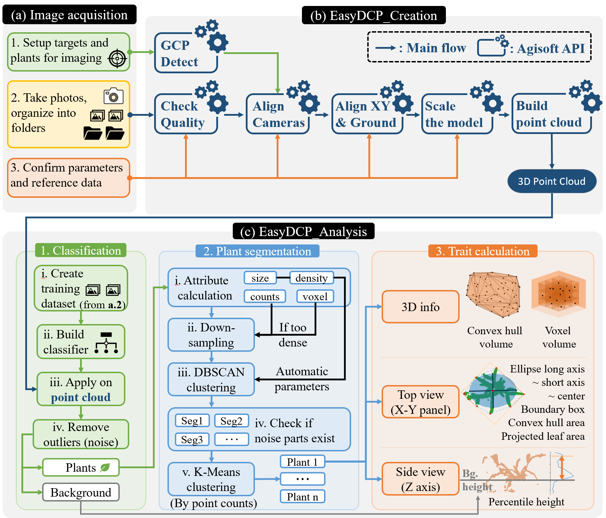

## EasyDCP (Easy Dense Cloud Phenotyping)

**TODO: Update text in image**

A python package for agricultural phenotypic trait extraction from 2D image sets via 3D reconstruction and analysis of 3D point clouds.
This script handles multiple sets of images taken in the same environment, such as timescale photos of a plot or several groups of plants photographed in the same place.
EasyDCP consists of two components:

- EasyDCP_Creation, which produces a 3D point cloud (.ply format) from a set of 2D source images.
- EasyDCP_Analysis, which analyzes a .ply file, detects individual plants and measures their traits.

Key features:

- Measure plant height, long and short axis, projected leaf area, convex hull volume, and more
- Batch processing multiple image sets

Details are provided in our paper: 

**Feldman, A., Wang, H., Fukano, Y., Kato, Y., Ninomiya, S., & Guo, W. (2021). EasyDCP: an affordable, high-throughput tool to measure plant phenotypic traits in 3D.** Manuscript submitted for publication.

Please see the [docs](https://github.com/oceam/EasyDCP/tree/master/docs) folder containing instructions for [installation](https://github.com/oceam/EasyDCP/blob/master/docs/Installation.md), [troubleshooting](https://github.com/oceam/EasyDCP/blob/master/docs/Troubleshooting.md), [image acquisition](https://github.com/oceam/EasyDCP/blob/master/docs/0_Image_acquisition.md), and operation of [EasyDCP_Creation](https://github.com/oceam/EasyDCP/blob/master/docs/1_EasyDCP_Creation.md) and [EasyDCP_Analysis](https://github.com/oceam/EasyDCP/blob/master/docs/2_EasyDCP_Analysis.md).

Example scripts are provided in the [example](https://github.com/oceam/EasyDCP/tree/master/example) folder. 

**TODO: change 'oceam' to 'UTokyo-FieldPhenomics-Lab' in links after finished and forked.**

**TODO: delete or finish/integrate** [API.md](https://github.com/oceam/EasyDCP/blob/master/docs/API.md)

